# EduPortal — Academic Management System

A full-stack academic platform with separate portals for Students, Teachers, and Admins — featuring online quizzes with anti-cheat protection, result publishing, and a shared resource library.


---

## Why I Built This

Managing quizzes, results, and study material across a classroom is messy when spread across WhatsApp and Google Forms. EduPortal centralizes everything — admin controls users, teachers own their quizzes and results, students have a clean portal to attempt quizzes and access resources. The anti-cheat layer (tab switch and screen change detection) was the most interesting engineering challenge.

---

## Tech Stack

- **Frontend:** React, Tailwind CSS
- **Backend & Auth:** Supabase (Auth, PostgreSQL, Row Level Security, Edge Functions)
- **Hosting:** Vercel / Netlify

---

## Features

- **Role-based portals** — fully separate UI and access for Admin, Teacher, and Student
- **Admin controls** — create and manage student and teacher accounts, oversee all activity
- **Quiz system** — teachers build and publish quizzes; students attempt them with a countdown timer
- **Anti-cheat protection** — tab switching and screen/window change events are detected and flagged during a live quiz
- **Result management** — teachers release marks per quiz; students see results on their dashboard
- **Resource manager** — teachers upload past papers and study material; students browse and download by subject

---

## Access

This system holds real student, teacher, and quiz data, so it isn't publicly hosted. If you'd like to explore the live system, reach out for demo credentials:

- **Email:** mubeenahmerbali@gmail.com
- **LinkedIn:** [linkedin.com/in/mubeen-ahmer](https://www.linkedin.com/in/mubeen-ahmer-2b162b344/)
- **Portfolio:** [mubeenahmer.vercel.app](https://mubeenahmer.vercel.app/)

---

## Project Structure

```
eduportal/
├── assets/                   # Screenshots and demo media for README
├── public/
├── src/
│   ├── components/
│   ├── contexts/
│   ├── pages/
│   ├── utils/
│   ├── App.jsx
│   ├── index.css
│   ├── main.jsx
│   └── supabaseClient.js
├── .env.example
├── .gitignore
├── index.html
├── package.json
├── vite.config.js
└── README.md
```


---

# Screenshots

## Admin
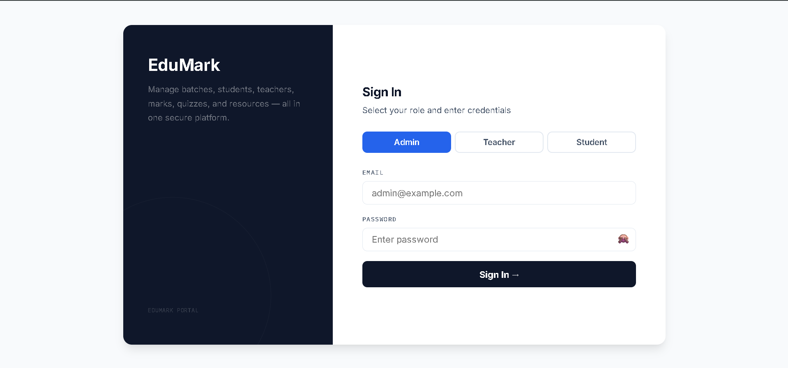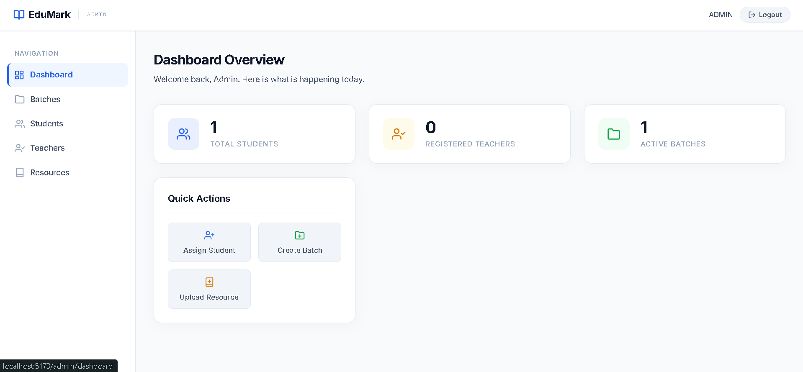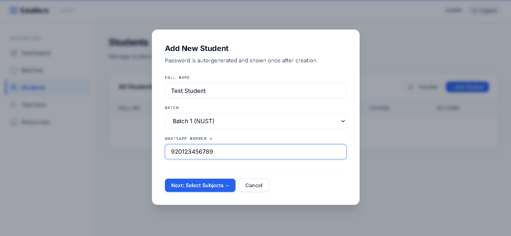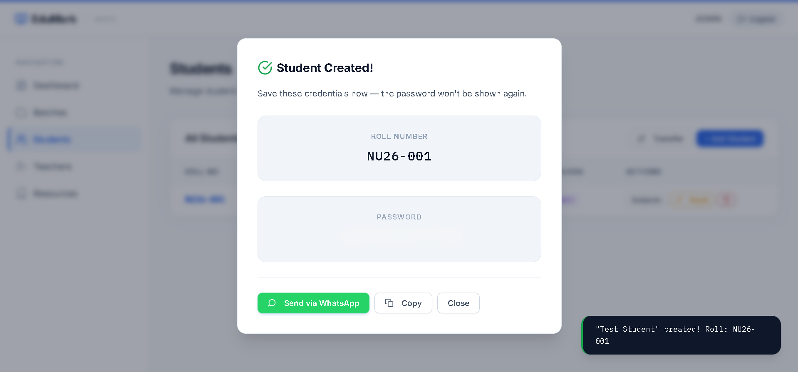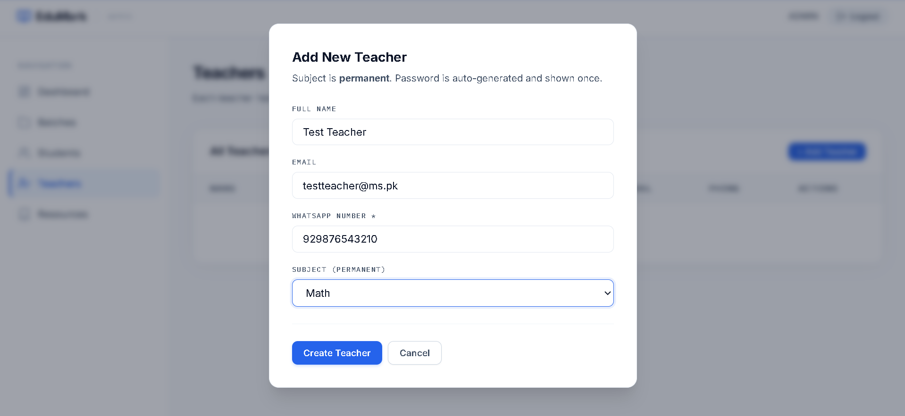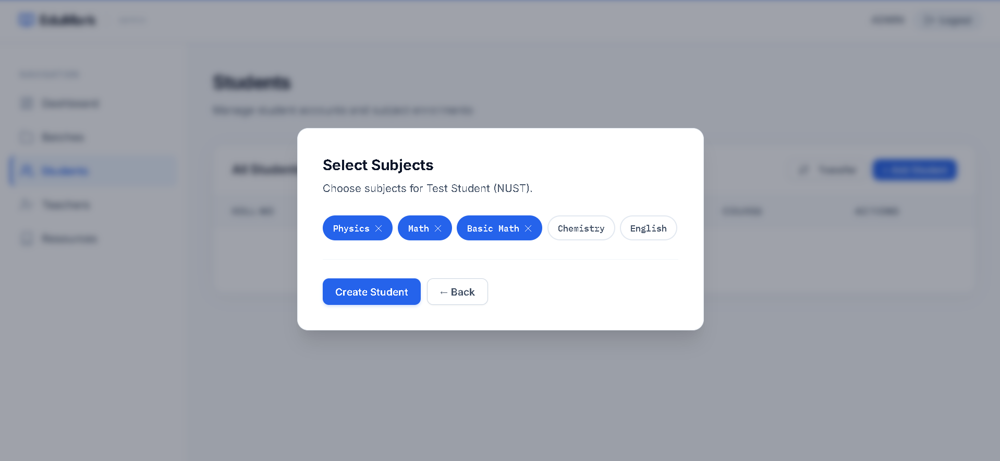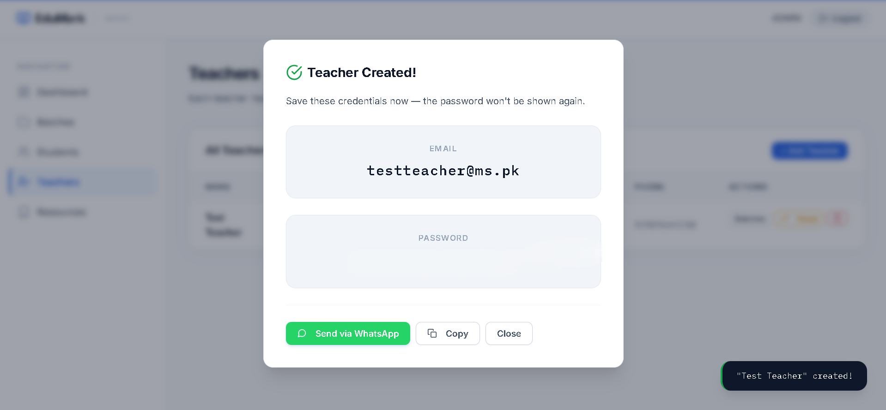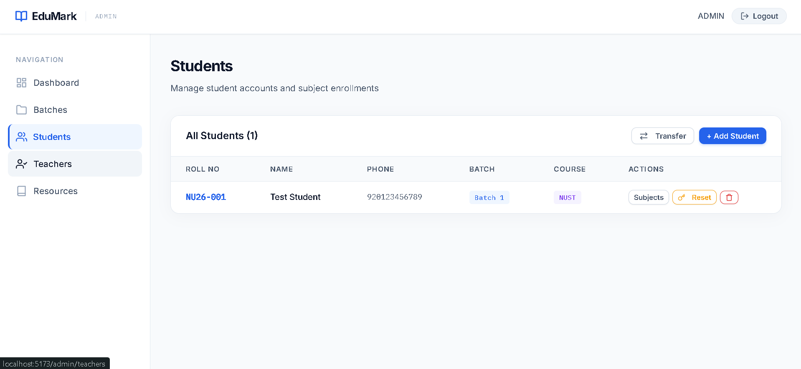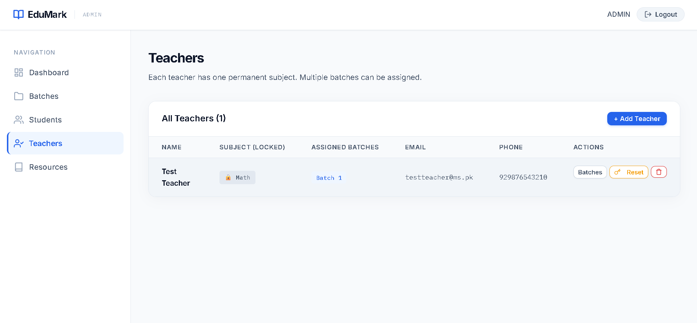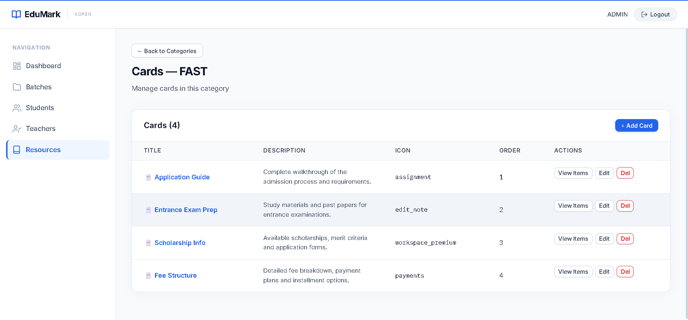

---
## Student
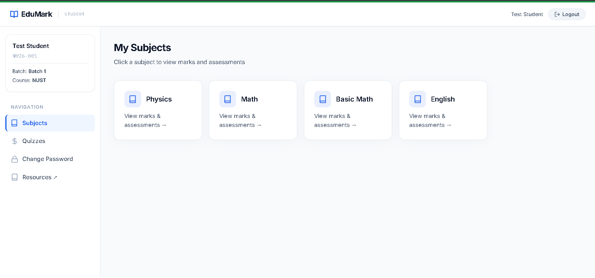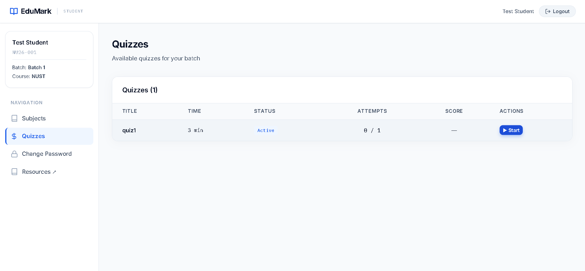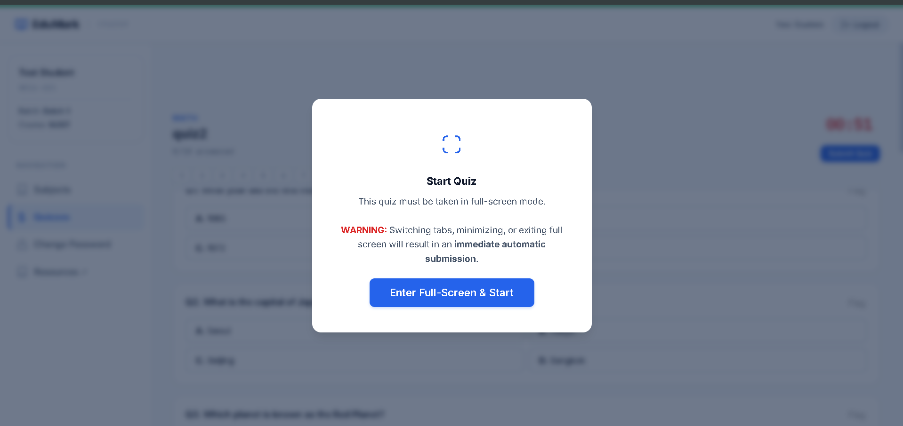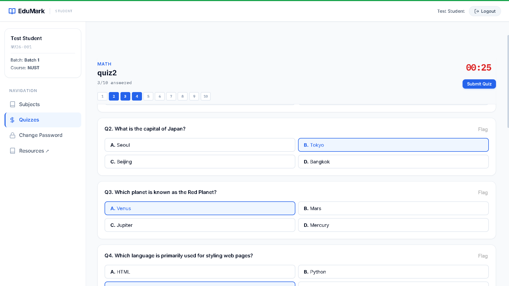  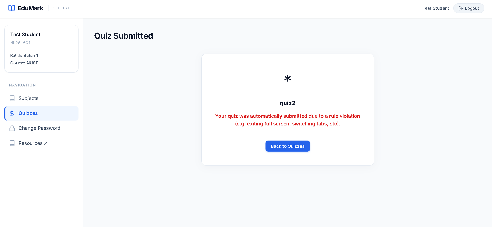

---

## Teacher
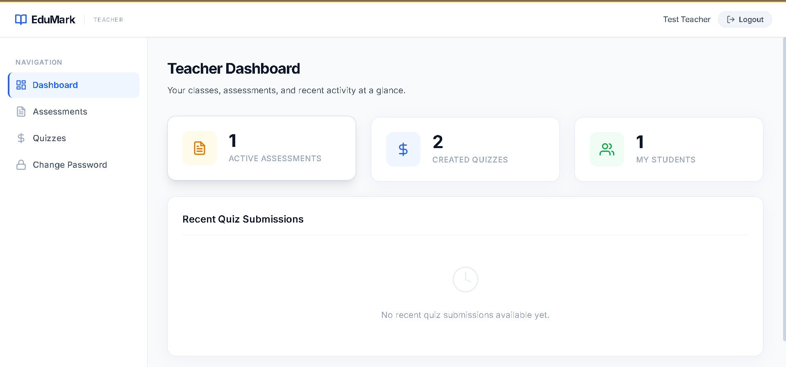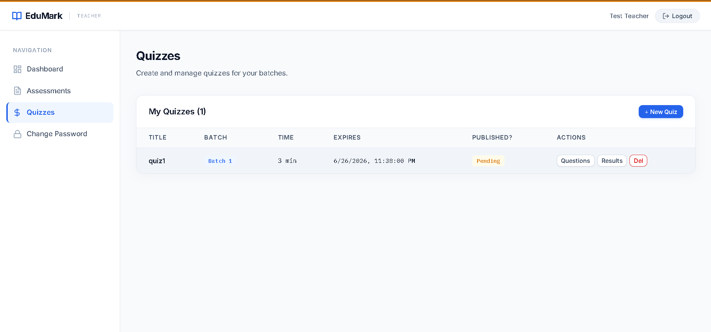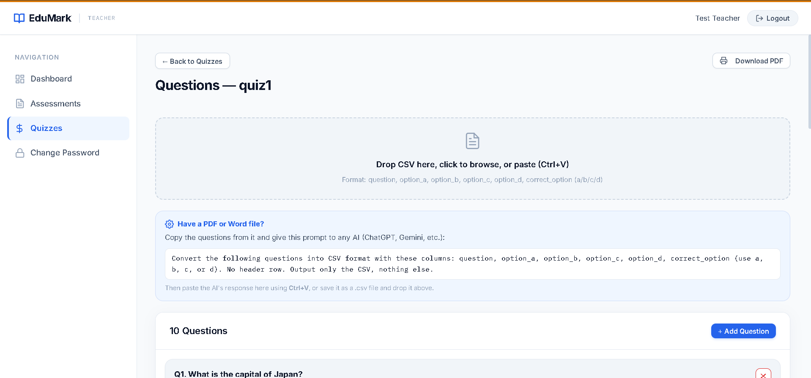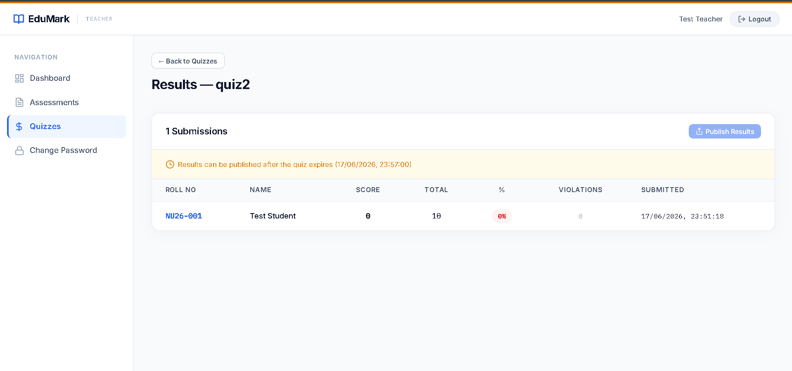

---
## Resource Manager 

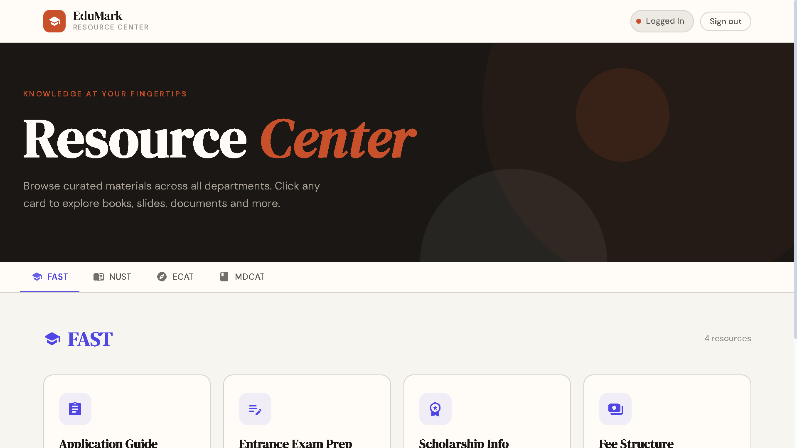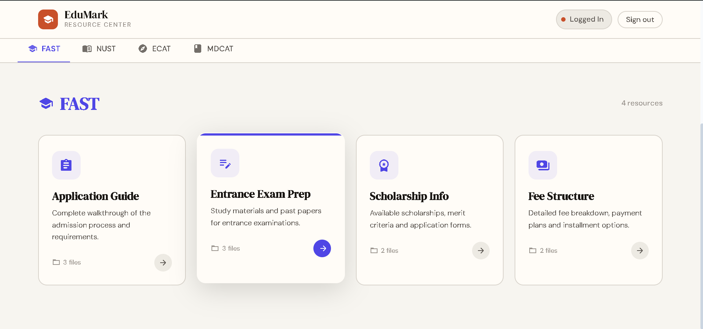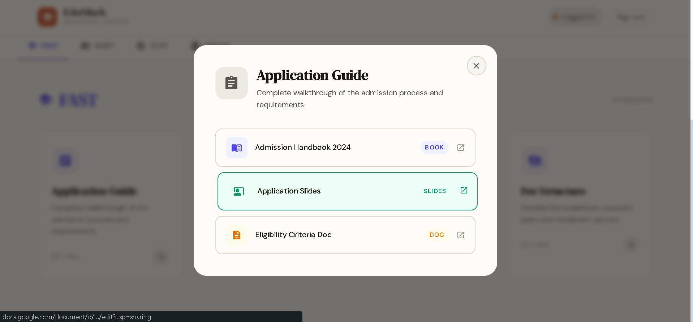

